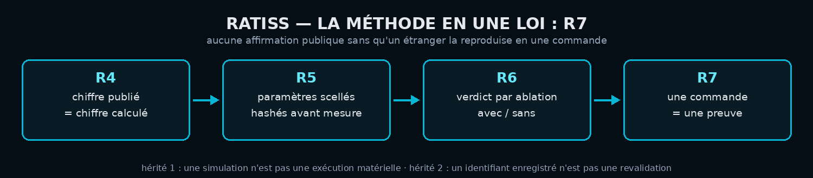
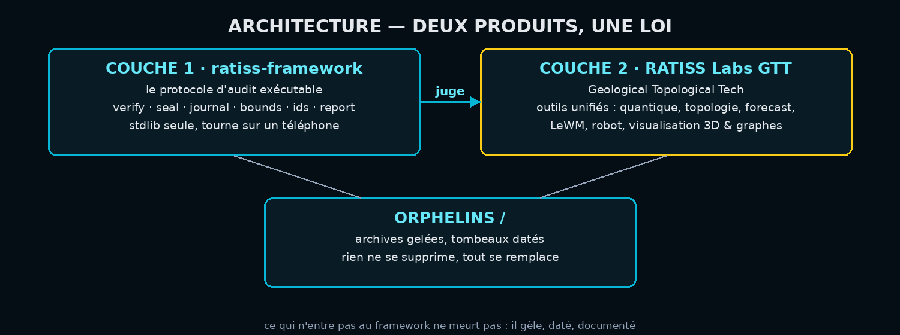
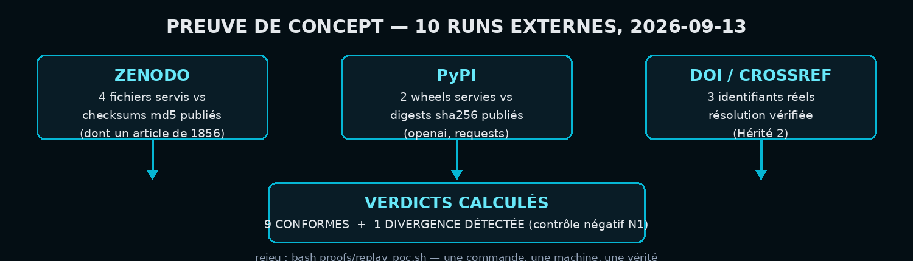

<div align="center">


# RATISS-Framework
### le protocole d'audit scientifique exécutable

   

*Une seule loi : **R7** — aucune affirmation publique sans qu'un étranger puisse la reproduire en une commande.*

</div>

> **⚠️ Banc d'essai.** Ce dépôt vit sur un compte jetable créé le 2026-09-12
> pour valider la chaîne de consolidation avant migration vers le compte
> principal de Jonathan Evina. Il sera supprimé ou migré sur décision du chef.
> Rien ici n'est un résultat scientifique : c'est la **méthode**, testée en public.

---

## 🔬 Le laboratoire

**RATISS Labs** — labo indépendant, Yaoundé, Cameroun.
Nous auditons les artefacts publics de la recherche : hashes, identifiants,
plausibilité physique, reproductibilité. Chaque rapport est publié avec son
annexe de reproduction.

🌍 Site du labo (certifié par rejeu) : https://jonathansearch.github.io/ratiss-labs-site/
📄 Rapport d'audit public : https://github.com/jonathansearch/ratiss-audit-public

## 🧑🏾‍🔬 Moi

**Jonathan Evina** — 18 ans, Yaoundé. Plus haut diplôme : le BEPC.
Autodidacte intégral, huit mois, trois téléphones perdus, sept mois de
connexion morte. Aucun laboratoire, aucun conseiller, aucune institution.
ORCID : [0009-0000-4092-5313](https://orcid.org/0009-0000-4092-5313) ·
GitHub : [jonathansearch](https://github.com/jonathansearch)

## 🤝 Nous

Le labo tourne en **deux équipes** :

| Équipe | Rôle | Autorité |
|---|---|---|
| 🏗️ Création (OpenHands, agents) | construit, pousse, casse-construit | aucune sur la publication |
| 🛡️ Rouge (auditeur indépendant) | vérifie anonymement, certifie ou déclare « divergence » | **veto absolu** |

L'auditeur a priorité sur le chef de labo. C'est la règle qui a attrapé la
fabrication dans nos propres artefacts en septembre 2026 — et qui nous a
sauvés.

## 📬 Contact

️ **Email professionnel : jonathan.ratisslabs@zohomail.com** (boîte vérifiée :
réception externe confirmée le 2026-09-12)
💬 Issues & discussions : dépôt `ratiss-audit-public` · Toute demande d'audit
fait l'objet d'un mandat public : périmètre déclaré, métriques scellées avant
audit, publication intégrale, aucun droit de regard ni délai de correction.

## ⚖️ La méthode — une seule loi



| Règle | Énoncé |
|---|---|
| **R4** | Raisonnement conceptuel toujours autorisé ; chiffre publié seulement s'il a été calculé, avec paramètres et hash. |
| **R5** | Prompts et paramètres scellés, hashés dans chaque run ; modification après mesure = journal des déviations. |
| **R6** | Bras expérimentaux séparés du chemin critique ; verdict par ablation avec/sans, jamais par intuition. |
| **R7** | Aucune affirmation publique sans qu'un étranger puisse la reproduire en une commande. |
| Hérité 1 | Une simulation n'est pas une exécution matérielle. |
| Hérité 2 | Un identifiant enregistré n'est pas une revalidation en temps réel. |

Transcrite en code stdlib : `verify` (hashes & formes), `seal` (manifestes
scellés), `journal` (déviations chaînées), `bounds` (plausibilité physique,
borne de Tsirelson), `ids` (DOI & identifiants), `report` (rapports sans vide),
`__main__` (la commande unique).

```bash
python -m ratiss audit --url <url> --sha256 <hash>     # intégrité d'un artefact servi
python -m ratiss audit-zenodo --record <id> --file <f> # checksum publié vs octets servis
python -m ratiss doi <doi>                             # résolution d'identifiant (Hérité 2)
python -m ratiss chsh <valeur>                         # borne de Tsirelson |S| ≤ 2√2
```

## 🏗️ Architecture — deux produits, une loi



- **Couche 1 (ce dépôt) :** le protocole d'audit exécutable.
- **Couche 2 (RATISS Labs GTT — Geological Topological Tech) :** l'unification
  de l'écosystème RATISS en une branche transdisciplinaire — visualisation,
  3D, graphes — construite sous les reines du chef de labo.
- **La couche 1 juge la couche 2.** Une fois les deux debout, c'est ce
  protocole qui auditera GTT, pas l'inverse.
- **Orphelins :** ce qui n'entre pas ne meurt pas — il gèle, daté, documenté.

## 🧪 Preuve de concept — 10 runs externes (2026-09-13)



| Plateforme | Cibles | Verdicts |
|---|---|---|
| Zenodo | 4 fichiers servis vs checksums md5 publiés (dont un article de chimie de **1856**) | 4 CONFORMES |
| PyPI | wheels `openai` & `requests` vs digests sha256 publiés | 2 CONFORMES |
| DOI / Crossref | 3 identifiants réels, résolution vérifiée | 3 RESOUT |
| Contrôle négatif | digest openai appliqué à la wheel requests | **1 DIVERGENCE DÉTECTÉE** |

Une méthode qui ne sait pas dire non ne prouve rien : le contrôle négatif est
là pour ça.

**Run spécial millénaire (2026-09-13) :** la revendication OpenAI
Navier–Stokes auditée — papier scellé, dépôt Lean scellé au commit, registre
Clay consulté (aucune résolution décernée), préprints concurrents non
atteignables par identifiant stable. Détails :
[`proofs/POC-MILLENAIRE-2026-09-13.md`](proofs/POC-MILLENAIRE-2026-09-13.md). Détails, portée des verdicts et limites :
[`proofs/POC-EXTERNAL-AUDITS-2026-09-13.md`](proofs/POC-EXTERNAL-AUDITS-2026-09-13.md).

## ▶️ Reproduire (R7)

```bash
git clone https://github.com/brossbernard2-pixel/RATISS-Framework.git
cd RATISS-Framework
python3 -m pytest -q                 # 47 tests hors-ligne, stdlib seule
python3 -m pytest -q --run-network   # + 4 tests réseau marqués
bash proofs/replay_poc.sh            # les 10 runs externes, une commande
```

## 🗺️ Provenance

Chaque module porte sa ligne dans [`audit/PROVENANCE.md`](audit/PROVENANCE.md) :
dépôt source, commit source, réécrit ou copié, auditeur nommé.
Module sans provenance = module refusé. Auditeur pré-rempli = faute (règle N2 :
`EN ATTENTE` jusqu'au visa Rouge).

## 📜 Licence

**MIT** — Copyright (c) 2026 Jonathan Evina, RATISS Labs.
Voir [`LICENSE`](LICENSE). La méthode est libre ; les rapports d'audit sont
publiés avec leurs annexe de reproduction ; le cadre reste libre à jamais.

---

<div align="center">

*Le labo journalise ses propres retards. C'est précisément ce qui le rend crédible.*

</div>
